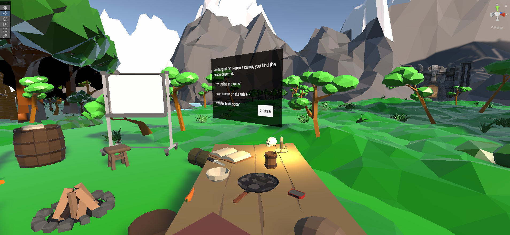
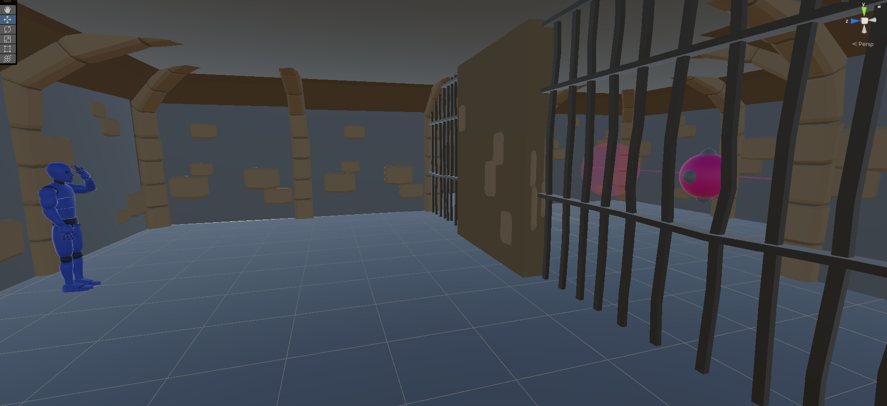

# Eyepath

This is a small VR project developed for the Interacrive Graphical Systems course in the Master of Informathics Engeneering offered by the UPC school. 

This is a small VR puzzle game whose main mechaninc is that when you cover one eye with your hand you gain the ability to interact with objects that are far away.

Covering one eye with a hand stops the corresponding screen of the vr glasses so that you may reach and grab for far away objects without seeing double. 

The story revolved around going to these mysterious ruins that your friends was investigating where you gained these powers. 

This project was made using Unity and free assets. 
